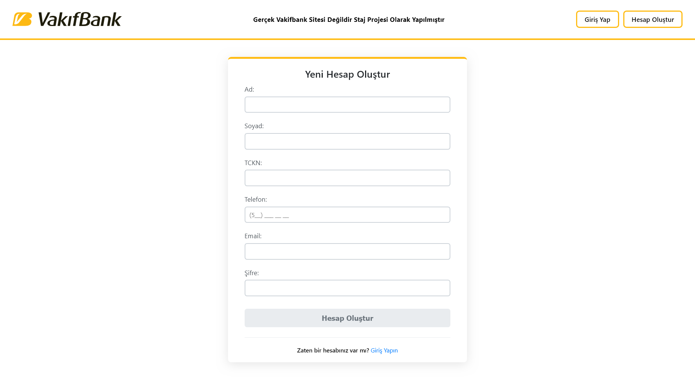
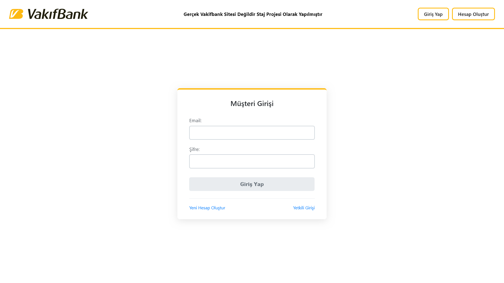
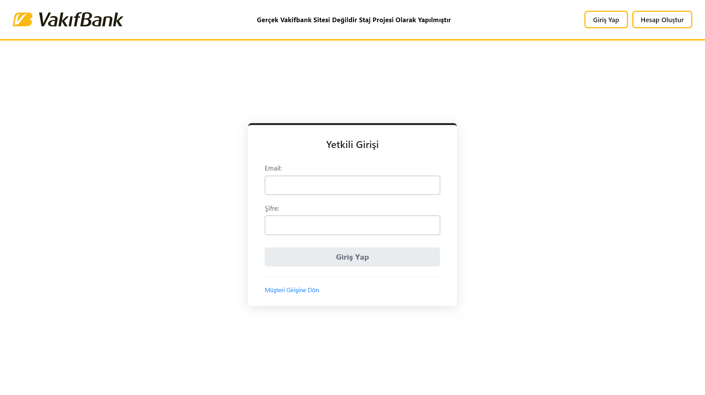

# Staj Projesi

Bu proje, bir kredi hesaplama ve başvuru sistemi uygulamasıdır. Frontend tarafı Angular ile, backend tarafı .NET Core ile yazılmıştır. Backend tarafında MySQL veritabanı kullanılmıştır.


## Ekran Görüntüleri                                                                                                     


*Anasayfa*
                                                                                    


*Üye Ol Sayfası*                                                                                                         
                                                                                    


*Müşteri Login Sayfası*                                                                                                  
                                                                           


*Admin Login Sayfası*                                                                                                                                                                                                                              │
                                                                               


## Proje Yapısı

- `staj-frontend`: Angular frontend uygulaması
- `stajapi`: .NET Core backend API

## Kullanılan Teknolojiler

### Frontend
- Angular 20

### Backend
- .NET Core 9
- Entity Framework Core
- MySQL
- Swagger
- Rate Limiting

## Kurulum

### Ön Koşullar
- Node.js (v20 veya üzeri)
- .NET Core SDK (v9 veya üzeri)
- MySQL

### Projeyi Klonlama ve Çalıştırma

1.  **Depoyu klonlayın:**
    ```bash
    git clone <repo-url>
    cd staj-proje
    ```

2.  **Frontend Kurulumu:**
    - `staj-frontend` dizinine gidin: `cd staj-frontend`
    - Bağımlılıkları yükleyin: `npm install`
    - Uygulamayı başlatın: `npm start`
    - Uygulama `http://localhost:4200` adresinde çalışmaya başlayacaktır.

3.  **Backend Kurulumu:**
    - `stajapi` dizinine gidin: `cd stajapi`
    - Bağımlılıkları yükleyin: `dotnet restore`
    - Veritabanı migration'larını çalıştırın: `dotnet ef database update`
    - Uygulamayı başlatın: `dotnet run`
    - API `http://localhost:5141` adresinde çalışmaya başlayacaktır.

4.  **Veritabanı Ayarları:**
    - `stajapi/appsettings.json` dosyasında veritabanı bağlantı cümlesini kendi ortamınıza göre güncelleyin.
   
5.  **API Dökümantasyonu:**
    - Swagger UI üzerinden API'yi test edebilirsiniz: `http://localhost:5141/swagger/index.html`
